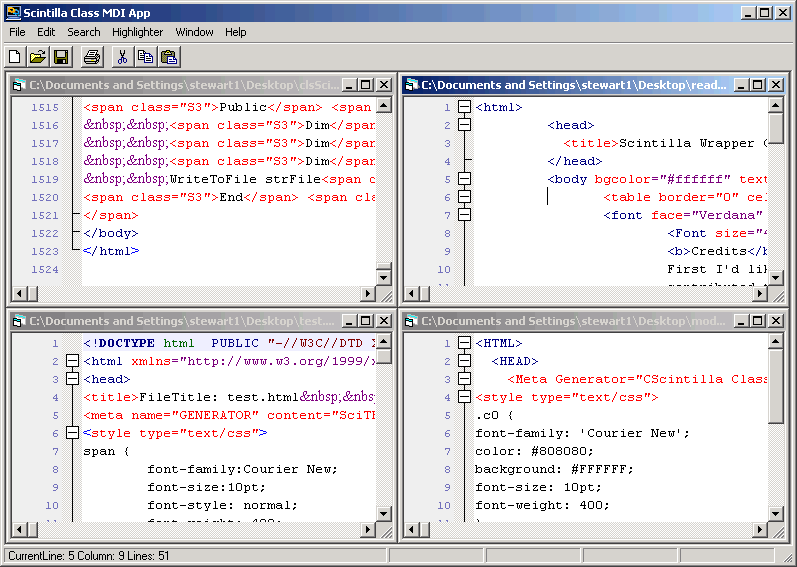



## MDI Source Code Editor Sample using Scintilla Wrapper

### Description

UPDATE.....  

Added an options dialog. Made it generic enough you could reuse it in another application. The code to call and utilize it is all wrapped into the modHighlighter.bas file. Please note you can download at http://www.ceditmx.com/products/scintilla/dl.php?file=cedits2&access=http://www.ceditmx.com/products/scintilla/scintillamdi.zip.

  

Downloading from the site will give you the scilexer.dll that you need. Or you can download the file here and get scilexer.dll from the compiled scite demo from http://www.scintilla.org  

This is a sample of utilizing the Scintilla Wrapper in an MDI application enviroment. This is in reality a fairly complete basic Source code Editor. It lacks most of the fancy features that you have seen in my cEdit app but it's a good simple to read and follow idea of how to use Scintilla within VB and an MDI app. Note I added Print to it and I'd like to thank Dasith Wijesiriwardena for his WYSIWYG RTF code. It took some fairly heavy modifications from his code to work but it lead me in the right direction to getting the print code setup. Also I improved the ExportToHTML function drasticly. It can now do a 2000 line piece of code in around 3 seconds. Also ReplaceAll has been improved and is quite a bit faster. I'd like to see Open improved in speed in next release. Please leave comments and if you like it feel free to vote. But especially leave comments :)
 
### More Info
 
Download at: http://www.ceditmx.com/products/scintilla/dl.php?file=cedits2&amp;access=http://www.ceditmx.com/products/scintilla/scintillamdi.zip

             |
---                |---
**Submitted On**   |2005-09-05 18:58:38
**By**             |[Stewart](https://github.com/Planet-Source-Code/PSCIndex/blob/master/ByAuthor/stewart.md)
**Level**          |Intermediate
**User Rating**    |4.9 (39 globes from 8 users)
**Compatibility**  |VB 6\.0
**Category**       |[Complete Applications](https://github.com/Planet-Source-Code/PSCIndex/blob/master/ByCategory/complete-applications__1-27.md)
**World**          |[Visual Basic](https://github.com/Planet-Source-Code/PSCIndex/blob/master/ByWorld/visual-basic.md)
**Archive File**   |[MDI\_Source193028962005\.zip](https://github.com/Planet-Source-Code/stewart-mdi-source-code-editor-sample-using-scintilla-wrapper__1-62446/archive/master.zip)

